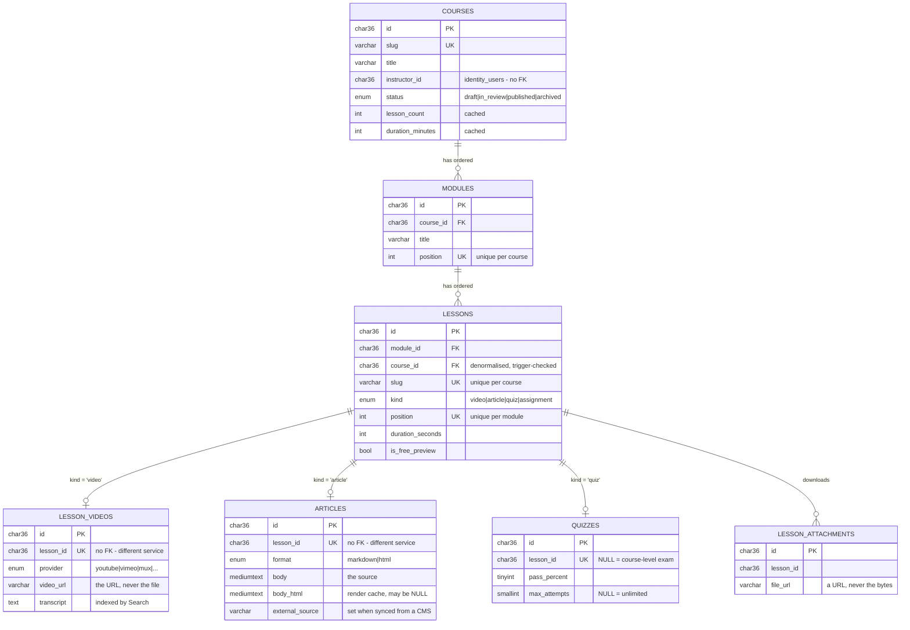
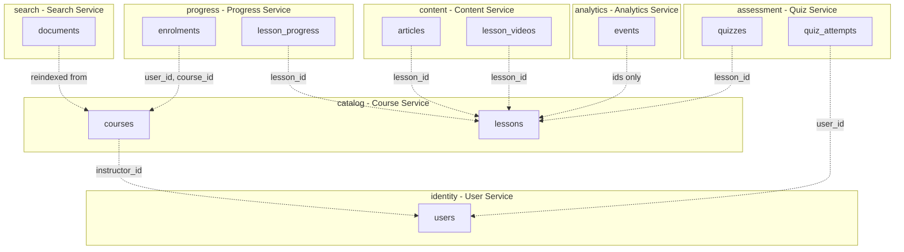
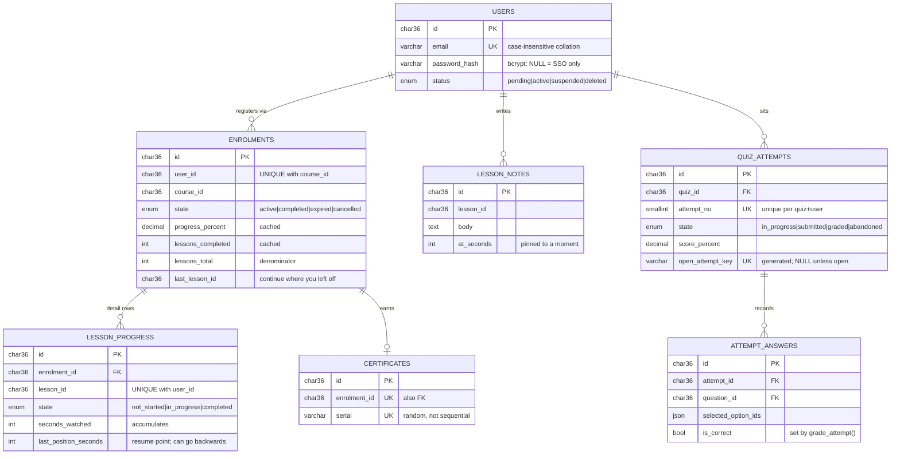

# learning_db

MySQL schema for the learning platform: **31 tables across 8 databases**, one
database per microservice.

This README is the complete reference — the ERD, then every database, table and
column. The column tables are generated from the live schema, so the types,
keys and nullability here are what MySQL actually holds, not what someone
remembered.

| Repo | What it is |
|---|---|
| **learning_db** | This repo. The schema. |
| [learning_apis](https://github.com/noshadalam66/learning_apis) | Seven Node.js microservices plus a gateway. |
| [learning_website](https://github.com/noshadalam66/learning_website) | The PHP front end. |

**Contents**

- [Quick start](#quick-start)
- [The ERD](#the-erd)
  - [The spine](#the-spine) · [Where the foreign keys stop](#where-the-foreign-keys-stop) · [The learner's side](#the-learners-side)
- [The table groups](#the-table-groups)
- [Reading the tables below](#reading-the-tables-below)
- [Data dictionary](#data-dictionary)
  - [`identity`](#identity--user-service) · [`catalog`](#catalog--course-service) · [`content`](#content--content-service) · [`progress`](#progress--progress-service) · [`assessment`](#assessment--quiz-service) · [`search`](#search--search-service) · [`analytics`](#analytics--analytics-service)
- [Stored routines](#stored-routines)
- [How the platform uses this schema](#how-the-platform-uses-this-schema)
- [Migrations](#migrations)
- [Verification](#verification)

---

## Quick start

Requires **MySQL 8.0.16 or newer** — earlier versions parse `CHECK` constraints
and silently ignore them, which would make a third of this schema decorative.

```bash
cp .env.example .env          # then edit the password
docker compose up -d          # or point .env at any MySQL 8.0.16+
./scripts/migrate.sh          # create the databases and apply migrations
./scripts/seed.sh             # load the demo catalogue
./scripts/verify.sh           # assert it all came out right
```

`./scripts/reset.sh` drops everything and rebuilds. `./scripts/console.sh`
opens a shell with the right charset and time zone.

Demo accounts all use the password `Password123!` — `sam@learning.test`
(student, part way through two courses), `grace@learning.test` (instructor),
`admin@learning.test` (admin).

---

## The ERD

There is also a [visual version](https://claude.ai/code/artifact/9c966486-1cd3-48e3-b168-d8465097a467),
and a copy ships as [`docs/erd.html`](docs/erd.html). More diagrams — one per
service — are in [`docs/ERD.md`](docs/ERD.md).

### The spine

Thirty-one tables looks like a lot until you notice that almost all of them
hang off one chain. **A course holds ordered modules; a module holds ordered
lessons; a lesson has exactly one body.**



Three things worth noticing:

1. **A lesson row carries no body of its own.** `lessons.kind` names which of
   the three tables to look in, and they are mutually exclusive.
2. **`lessons.course_id` is redundant** — you could reach the course through
   `module_id`. It is carried anyway so "every lesson of this course, in order"
   needs no join, and a trigger rejects any row where the two disagree.
3. **The bodies live in a different service.** `lesson_videos`, `articles` and
   `quizzes` all point at `lessons.id` with no foreign key.

### Where the foreign keys stop

Everything lives in one database. The per-service split is carried by a prefix
on the table name — `catalog_`, `identity_`, and so on — rather than by a
database boundary the server enforces. The grouping below is that convention,
not something MySQL is checking.



**Every dotted arrow is a column holding an id with no constraint behind it.**
All 21 real foreign keys live *inside* one database:

| Database | Foreign keys within it |
|---|---|
| `catalog` | 7 |
| `assessment` | 5 |
| `identity` | 4 |
| `progress` | 2 |
| `content` | 1 |
| `search`, `analytics` | 0 — both are derived stores |

This is a **choice, not a MySQL limitation**. InnoDB supports foreign keys
across databases on the same server; one would work today. It is left out
because a foreign key across a service boundary means those two services can
never be moved onto separate servers — the exact flexibility the split was
bought for. The costs are real and named in
[`docs/DECISIONS.md`](docs/DECISIONS.md).

### The learner's side

Everything above is the catalogue. This is what a person accumulates against it.



---

## The table groups

One database, 32 tables, and a prefix on each that says which service owns it.
The database is named only in the connection string, so it can be whatever the
host calls it — on cPanel that is the account prefix plus your name,
`noshadal_learning`.

| Prefix | Owning service | Tables | Holds |
|---|---|---|---|
| `identity_` | User Service | 5 | Accounts, password hashes, roles, session and verification tokens |
| `catalog_` | Course Service | 7 | Courses, modules, lessons, categories, tags, reviews |
| `content_` | Content Service | 4 | Article bodies, article history, video URL metadata, attachments |
| `progress_` | Progress Service | 4 | Enrolments, per-lesson progress, notes, certificates |
| `assessment_` | Quiz Service | 5 | Quizzes, questions, options, attempts, answers |
| `search_` | Search Service | 3 | Denormalised search documents, query log, synonyms |
| `analytics_` | Analytics Service | 3 | Behaviour events (partitioned), two daily rollups |
| `v_` | — | 3 views | The cross-service read views; owned by nobody |
| `platform_` | — | 1 | `schema_migrations`, the migration ledger |

Each service is the **only writer** to its own database. Cross-service reads go
through the views in `platform`, or over HTTP. Migration `0009` creates a MySQL
account per service (`svc_user`, `svc_course`, …) granted write access to its
own database and nothing else, so the boundary is enforced by the server rather
than remembered by people.

The three views in `platform`:

| View | What it joins | Who reads it |
|---|---|---|
| `v_course_outline` | course → module → lesson → video / article / quiz | The Course Service, for the whole curriculum in one query |
| `v_course_cards` | published courses + category + instructor + enrolment count | The catalogue listing |
| `v_learner_course_progress` | enrolment + course + certificate | The dashboard and lesson player |

---

## Reading the tables below

- **Type** is the real MySQL column type.
- **Key** shows `PK`, `FK` (with its target), or `generated` for a computed
  column. A column with no key marker may still be *logically* a reference —
  the Meaning column says so where that is the case.
- Columns marked **cached** are denormalised copies. Each has exactly one
  routine that recomputes it, and `tests/verify.sql` fails if it drifts from
  the rows it summarises.
- Every id column is `CHAR(36) CHARACTER SET ascii` holding a uuid. The
  charset matters: **InnoDB refuses a foreign key between columns whose
  character sets differ**, and the verify suite asserts none has crept in as
  `utf8mb4`.
- Every timestamp is `DATETIME(3)` defaulted to `UTC_TIMESTAMP(3)`, never
  `TIMESTAMP` (2038) and never `CURRENT_TIMESTAMP` (session time zone).

---

## Data dictionary

### `identity` — User Service

Accounts, credentials and roles. 5 tables.


#### `identity_refresh_tokens`

One row per live session. Only digests are stored.


| Column | Type | Null | Key | Meaning |
|---|---|---|---|---|
| `id` | `char(36)` | no | **PK** | Primary key. A uuid, so a service can mint one without a round trip. |
| `user_id` | `char(36)` | no | **FK** → `identity_users` | Whose session this is. Real foreign key, cascading. |
| `token_hash` | `char(64)` | no | — | SHA-256 of the token, never the token itself — a database leak hands nobody a usable session. `ascii_bin` so comparison is byte-exact. |
| `user_agent` | `varchar(500)` | yes | — | Browser string, so a person can recognise a session in the list. |
| `ip_address` | `varbinary(16)` | yes | — | `VARBINARY(16)` written with `INET6_ATON()`; holds IPv4 and IPv6 alike. MySQL's stand-in for PostgreSQL's `inet`. |
| `issued_at` | `datetime(3)` | no | — | When the session started. |
| `expires_at` | `datetime(3)` | no | — | Hard expiry, 30 days by default. A `CHECK` requires it to be after `issued_at`. |
| `revoked_at` | `datetime(3)` | yes | — | `NULL` means live. Set on logout, on password change and on suspension. |

**Unique** `(token_hash)`


#### `identity_roles`

Three rows in practice — `student`, `instructor`, `admin` — but a table rather than an enum so a role can be added without a migration.


| Column | Type | Null | Key | Meaning |
|---|---|---|---|---|
| `id` | `smallint unsigned` | no | **PK** | Small integer key — roles are a fixed handful, not entities that travel between services. |
| `name` | `varchar(50)` | no | — | `student`, `instructor` or `admin`. Unique. |
| `description` | `varchar(255)` | no | — | What the role is allowed to do, for the admin UI. |

**Unique** `(name)`


#### `identity_user_roles`

Many-to-many. A person can be both an instructor and an admin.


| Column | Type | Null | Key | Meaning |
|---|---|---|---|---|
| `user_id` | `char(36)` | no | **PK** **FK** → `identity_users` | Half of the composite primary key. Real foreign key, cascading on delete. |
| `role_id` | `smallint unsigned` | no | **PK** **FK** → `identity_roles` | The other half. Real foreign key. |
| `granted_at` | `datetime(3)` | no | — | When the role was assigned. |
| `granted_by` | `char(36)` | yes | **FK** → `identity_users` | Which admin assigned it. `SET NULL` if that admin is deleted, so the grant survives. |

#### `identity_users`

The account. Everything else in the platform points here, mostly without a foreign key.


| Column | Type | Null | Key | Meaning |
|---|---|---|---|---|
| `id` | `char(36)` | no | **PK** | Primary key. A uuid, so a service can mint one without a round trip. |
| `email` | `varchar(320)` | no | — | Login address. The `utf8mb4_0900_ai_ci` collation is case-insensitive, so `Ada@x.test` and `ada@x.test` collide on the unique index — this is what replaces PostgreSQL's `citext`. |
| `password_hash` | `varchar(255)` | yes | — | bcrypt digest. `NULL` means the account signs in through an identity provider and has no local password. |
| `full_name` | `varchar(150)` | no | — | Display name. A `CHECK` rejects a blank or whitespace-only value. |
| `headline` | `varchar(200)` | yes | — | One-line self-description shown under the name on an instructor page. |
| `bio` | `text` | yes | — | Longer profile text. |
| `avatar_url` | `varchar(2000)` | yes | — | Profile image. A `CHECK` requires `^https?://`. |
| `locale` | `varchar(10)` | no | — | Preferred language, e.g. `en` or `en-GB`. |
| `timezone` | `varchar(64)` | no | — | IANA zone used to render times to this person. Storage is always UTC. |
| `status` | `enum('pending','active','suspended','deleted')` | no | — | `pending` · `active` · `suspended` · `deleted`. Suspending revokes every session. |
| `email_verified_at` | `datetime(3)` | yes | — | Set when a verification token is consumed. `NULL` until then. |
| `last_login_at` | `datetime(3)` | yes | — | Updated on each successful login. |
| `created_at` | `datetime(3)` | no | — | When the row was inserted (UTC). |
| `updated_at` | `datetime(3)` | no | — | Last modification (UTC), maintained by a trigger. |

**Unique** `(email)`


#### `identity_verification_tokens`

Single-use tokens for e-mail verification and password reset.


| Column | Type | Null | Key | Meaning |
|---|---|---|---|---|
| `id` | `char(36)` | no | **PK** | Primary key. A uuid, so a service can mint one without a round trip. |
| `user_id` | `char(36)` | no | **FK** → `identity_users` | Whose token. Real foreign key, cascading. |
| `purpose` | `enum('email_verify','password_reset')` | no | — | `email_verify` or `password_reset`. The consume path matches on it, so a reset token cannot verify an address. |
| `token_hash` | `char(64)` | no | — | SHA-256 digest, as above. |
| `expires_at` | `datetime(3)` | no | — | Short-lived: 60 minutes for a reset, 24 hours for a verification. |
| `consumed_at` | `datetime(3)` | yes | — | Set by the same `UPDATE` that reads the token, so two concurrent requests cannot both use it. |
| `created_at` | `datetime(3)` | no | — | When the row was inserted (UTC). |

**Unique** `(token_hash)`


### `catalog` — Course Service

The spine: courses, modules and lessons. 7 tables.


#### `catalog_categories`

The subject taxonomy. Self-referencing, so sub-categories are possible.


| Column | Type | Null | Key | Meaning |
|---|---|---|---|---|
| `id` | `char(36)` | no | **PK** | Primary key. A uuid, so a service can mint one without a round trip. |
| `parent_id` | `char(36)` | yes | **FK** → `catalog_categories` | Self-reference for a sub-category. `SET NULL` on delete. Cannot equal `id` — enforced by a trigger, because MySQL forbids a `CHECK` on a column carrying a referential action. |
| `slug` | `varchar(120)` | no | — | URL segment. A `CHECK` enforces lowercase-hyphenated. |
| `name` | `varchar(150)` | no | — | Display name. |
| `description` | `varchar(1000)` | no | — | Shown on the category landing page. |
| `position` | `int` | no | — | Explicit sort order. Unique within its parent. |
| `created_at` | `datetime(3)` | no | — | When the row was inserted (UTC). |

**Unique** `(slug)`


#### `catalog_course_reviews`

One rating per learner per course. The source of the two cached rating columns.


| Column | Type | Null | Key | Meaning |
|---|---|---|---|---|
| `id` | `char(36)` | no | **PK** | Primary key. A uuid, so a service can mint one without a round trip. |
| `course_id` | `char(36)` | no | **FK** → `catalog_courses` | Reviewed course. Real foreign key, cascading. |
| `user_id` | `char(36)` | no | — | Reviewer. No foreign key. Unique with `course_id` — one review per person per course. |
| `rating` | `tinyint unsigned` | no | — | 1 to 5, enforced by a `CHECK`. |
| `comment` | `text` | no | — | Free text. May be empty; the rating is the required part. |
| `created_at` | `datetime(3)` | no | — | When the row was inserted (UTC). |
| `updated_at` | `datetime(3)` | no | — | Last modification (UTC), maintained by a trigger. |

**Unique** `(course_id,user_id)`


#### `catalog_course_tags`

Many-to-many between courses and tags.


| Column | Type | Null | Key | Meaning |
|---|---|---|---|---|
| `course_id` | `char(36)` | no | **PK** **FK** → `catalog_courses` | Half of the composite key. Real foreign key, cascading. |
| `tag_id` | `char(36)` | no | **PK** **FK** → `catalog_tags` | The other half. Real foreign key, cascading. |

#### `catalog_courses`

The course itself. Four columns here are caches — marked below.


| Column | Type | Null | Key | Meaning |
|---|---|---|---|---|
| `id` | `char(36)` | no | **PK** | Primary key. A uuid, so a service can mint one without a round trip. |
| `slug` | `varchar(120)` | no | — | URL identifier, e.g. `/course.php?slug=nodejs-microservices`. Unique, lowercase-hyphenated. |
| `title` | `varchar(200)` | no | — | Course title. |
| `subtitle` | `varchar(300)` | no | — | One-line pitch on the card and the hero. |
| `description` | `text` | no | — | Full prose description. |
| `category_id` | `char(36)` | yes | **FK** → `catalog_categories` | Real foreign key to `catalog_categories`. `SET NULL` so deleting a category does not delete courses. |
| `instructor_id` | `char(36)` | no | — | Who teaches it. Points at `identity_users.id` with **no** foreign key — the deliberate service boundary. |
| `level` | `enum('beginner','intermediate','advanced','expert')` | no | — | `beginner` · `intermediate` · `advanced` · `expert`. |
| `language` | `varchar(10)` | no | — | Content language. Backticked in SQL because `language` is a MySQL keyword. |
| `status` | `enum('draft','in_review','published','archived')` | no | — | `draft` · `in_review` · `published` · `archived`. Only `published` appears in the catalogue. |
| `thumbnail_url` | `varchar(2000)` | yes | — | Card image. A URL, never a file. |
| `promo_video_url` | `varchar(2000)` | yes | — | Optional trailer. |
| `price_cents` | `int` | no | — | Integer minor units — never a float, because money and binary fractions do not mix. `0` means free. |
| `currency` | `char(3)` | no | — | ISO 4217 code for `price_cents`. |
| `duration_minutes` | `int` | no | — | **Cached.** Sum of published lesson durations. Refreshed by `catalog_refresh_course_rollup()`. |
| `lesson_count` | `int` | no | — | **Cached.** Number of published lessons. Same procedure. |
| `rating_average` | `decimal(3,2)` | no | — | **Cached.** Mean of `course_reviews.rating`. Refreshed by `catalog_refresh_course_rating()`. |
| `rating_count` | `int` | no | — | **Cached.** How many reviews that mean is over. |
| `learning_outcomes` | `json` | no | — | JSON array of "you will be able to…" strings. MySQL has no array type; a `CHECK` requires `JSON_TYPE = 'ARRAY'`. |
| `requirements` | `json` | no | — | JSON array of prerequisites. |
| `published_at` | `datetime(3)` | yes | — | When it went live. A `CHECK` requires it whenever `status = 'published'` — that one line removes a whole family of blank-date bugs. |
| `created_at` | `datetime(3)` | no | — | When the row was inserted (UTC). |
| `updated_at` | `datetime(3)` | no | — | Last modification (UTC), maintained by a trigger. |

**Unique** `(slug)` · **FULLTEXT** `(title)`


#### `catalog_lessons`

The unit a learner actually opens. **`kind` decides which body table holds its content.**


| Column | Type | Null | Key | Meaning |
|---|---|---|---|---|
| `id` | `char(36)` | no | **PK** | Primary key. A uuid, so a service can mint one without a round trip. |
| `module_id` | `char(36)` | no | **FK** → `catalog_modules` | Owning chapter. Real foreign key, cascading. |
| `course_id` | `char(36)` | no | **FK** → `catalog_courses` | **Denormalised** — reachable via `module_id`, carried anyway so "every lesson of this course, in order" needs no join. A trigger rejects any row where the two disagree. |
| `slug` | `varchar(120)` | no | — | URL identifier, unique within the course. |
| `title` | `varchar(200)` | no | — | Lesson title. |
| `summary` | `varchar(2000)` | no | — | One-line description in the curriculum list. |
| `kind` | `enum('video','article','quiz','assignment')` | no | — | `video` · `article` · `quiz` · `assignment`. **This is the column that says which body table to look in.** |
| `status` | `enum('draft','in_review','published','archived')` | no | — | `draft` · `in_review` · `published` · `archived`. |
| `position` | `int` | no | — | Order within the module. Unique per module. |
| `duration_seconds` | `int` | no | — | Runtime or estimated reading time. Feeds the course rollup. |
| `is_free_preview` | `tinyint(1)` | no | — | When true, anyone may open this lesson without enrolling. |
| `created_at` | `datetime(3)` | no | — | When the row was inserted (UTC). |
| `updated_at` | `datetime(3)` | no | — | Last modification (UTC), maintained by a trigger. |

**Unique** `(module_id,position)` · **Unique** `(course_id,slug)`


#### `catalog_modules`

A chapter within a course. Ordered.


| Column | Type | Null | Key | Meaning |
|---|---|---|---|---|
| `id` | `char(36)` | no | **PK** | Primary key. A uuid, so a service can mint one without a round trip. |
| `course_id` | `char(36)` | no | **FK** → `catalog_courses` | Owning course. Real foreign key, cascading. |
| `title` | `varchar(200)` | no | — | Chapter title. |
| `summary` | `varchar(2000)` | no | — | Optional blurb under the chapter heading. |
| `position` | `int` | no | — | Order within the course. Unique per course — which is why reordering needs the staging trick. |
| `created_at` | `datetime(3)` | no | — | When the row was inserted (UTC). |
| `updated_at` | `datetime(3)` | no | — | Last modification (UTC), maintained by a trigger. |

**Unique** `(course_id,position)`


#### `catalog_tags`

Free-form topics, independent of the category tree.


| Column | Type | Null | Key | Meaning |
|---|---|---|---|---|
| `id` | `char(36)` | no | **PK** | Primary key. A uuid, so a service can mint one without a round trip. |
| `slug` | `varchar(120)` | no | — | URL identifier for the topic filter. |
| `name` | `varchar(120)` | no | — | Display name, e.g. `Node.js`. |

**Unique** `(slug)`


### `content` — Content Service

Lesson bodies — article text and video pointers. 4 tables.


#### `content_article_revisions`

Append-only history, written by a `BEFORE UPDATE` trigger on `articles`.


| Column | Type | Null | Key | Meaning |
|---|---|---|---|---|
| `id` | `char(36)` | no | **PK** | Primary key. A uuid, so a service can mint one without a round trip. |
| `article_id` | `char(36)` | no | **FK** → `content_articles` | Which article. Real foreign key, cascading. |
| `revision` | `int` | no | — | The version number this snapshot replaced. Unique per article. |
| `format` | `enum('markdown','html')` | no | — | The format at that revision — an article can switch between Markdown and HTML. |
| `title` | `varchar(300)` | no | — | The title at that revision. |
| `body` | `mediumtext` | no | — | The previous body, copied by the trigger before it was overwritten. |
| `edited_by` | `char(36)` | yes | — | Who made the edit that produced this snapshot. |
| `created_at` | `datetime(3)` | no | — | When the row was inserted (UTC). |

**Unique** `(article_id,revision)`


#### `content_articles`

The written body of a lesson, as Markdown or HTML.


| Column | Type | Null | Key | Meaning |
|---|---|---|---|---|
| `id` | `char(36)` | no | **PK** | Primary key. A uuid, so a service can mint one without a round trip. |
| `lesson_id` | `char(36)` | no | — | Which lesson this is the body of. Unique. No foreign key. |
| `title` | `varchar(300)` | no | — | Article heading, which may differ from the lesson title. |
| `format` | `enum('markdown','html')` | no | — | `markdown` or `html` — what `body` contains. Consumers never branch on it, because reads serve `body_html`. |
| `body` | `mediumtext` | no | — | The source text. For `html`, the already-sanitised version is what gets stored, so nothing unsafe is ever at rest. |
| `body_html` | `mediumtext` | yes | — | **Render cache, and legitimately `NULL`.** The Content Service renders from `body` when it is empty, so a row seeded by hand or synced from a CMS still serves correctly. |
| `excerpt` | `varchar(500)` | no | — | Plain-text summary for cards and search results. |
| `reading_time_minutes` | `int` | no | — | Derived from the word count at ~220 wpm. |
| `word_count` | `int` | no | — | Words in the rendered text, markup excluded. |
| `revision` | `int` | no | — | Incremented by the snapshot trigger on every body or title change. Never set by hand. |
| `author_id` | `char(36)` | yes | — | Who wrote it. Points at `identity_users.id`, no foreign key. |
| `status` | `enum('draft','in_review','published','archived')` | no | — | `draft` · `in_review` · `published` · `archived`. |
| `external_source` | `varchar(100)` | yes | — | Name of the headless CMS this was synced from, or `NULL` for a locally authored article. **A row with this set is read-only locally** — editing it would be overwritten by the next sync. |
| `external_id` | `varchar(200)` | yes | — | The entry id in that CMS. |
| `published_at` | `datetime(3)` | yes | — | Publication date. A `CHECK` requires it when `status = 'published'`. |
| `created_at` | `datetime(3)` | no | — | When the row was inserted (UTC). |
| `updated_at` | `datetime(3)` | no | — | Last modification (UTC), maintained by a trigger. |

**Unique** `(lesson_id)`


#### `content_lesson_attachments`

Downloadable extras. URLs again, never bytes.


| Column | Type | Null | Key | Meaning |
|---|---|---|---|---|
| `id` | `char(36)` | no | **PK** | Primary key. A uuid, so a service can mint one without a round trip. |
| `lesson_id` | `char(36)` | no | — | Which lesson the download belongs to. No foreign key. |
| `title` | `varchar(200)` | no | — | Link text, e.g. "Slides: the route layer". |
| `file_url` | `varchar(2000)` | no | — | **A URL, never the bytes.** A `CHECK` requires `^https?://`, and it is unique per lesson. |
| `mime_type` | `varchar(150)` | no | — | Content type, so the front end can pick an icon. |
| `size_bytes` | `bigint` | yes | — | File size for the "(2.1 MB)" hint. Nullable when unknown. |
| `position` | `int` | no | — | Order in the downloads list. |
| `created_at` | `datetime(3)` | no | — | When the row was inserted (UTC). |

**Unique** `(lesson_id,file_url)`


#### `content_lesson_videos`

A pointer to externally hosted video. **No media is stored in this database** — the verify suite fails the build if a binary column appears here.


| Column | Type | Null | Key | Meaning |
|---|---|---|---|---|
| `id` | `char(36)` | no | **PK** | Primary key. A uuid, so a service can mint one without a round trip. |
| `lesson_id` | `char(36)` | no | — | Which lesson this is the body of. Unique — one video per lesson. No foreign key. |
| `provider` | `enum('youtube','vimeo','mux','cloudflare','bunny','s3','external')` | no | — | `youtube` · `vimeo` · `mux` · `cloudflare` · `bunny` · `s3` · `external`. Decides how the front end embeds it. |
| `provider_asset_id` | `varchar(200)` | yes | — | The id at that provider, e.g. a YouTube id or a Mux playback id. |
| `video_url` | `varchar(2000)` | no | — | **The URL of the video, never the video.** A `CHECK` requires `^https?://`. |
| `hls_url` | `varchar(2000)` | yes | — | Adaptive-streaming manifest, when the provider has one. Separate from `video_url` because a player wants the manifest and a share link wants the watch page. |
| `download_url` | `varchar(2000)` | yes | — | Optional progressive MP4. |
| `thumbnail_url` | `varchar(2000)` | yes | — | Poster frame. |
| `captions_url` | `varchar(2000)` | yes | — | WebVTT track. |
| `transcript` | `mediumtext` | yes | — | Plain-text transcript. Indexed by the Search Service — this is how a search for a spoken phrase finds the lesson. |
| `duration_seconds` | `int` | no | — | Runtime as reported by the provider. |
| `width` | `int` | yes | — | Native pixel width, for aspect ratio. |
| `height` | `int` | yes | — | Native pixel height. |
| `created_at` | `datetime(3)` | no | — | When the row was inserted (UTC). |
| `updated_at` | `datetime(3)` | no | — | Last modification (UTC), maintained by a trigger. |

**Unique** `(lesson_id)`


### `progress` — Progress Service

Each learner's relationship to the spine. 4 tables.


#### `progress_certificates`

Issued once, on the transition into `completed`.


| Column | Type | Null | Key | Meaning |
|---|---|---|---|---|
| `id` | `char(36)` | no | **PK** | Primary key. A uuid, so a service can mint one without a round trip. |
| `enrolment_id` | `char(36)` | no | **FK** → `progress_enrolments` | Which enrolment earned it. Unique and a real foreign key — one certificate per enrolment. |
| `user_id` | `char(36)` | no | — | Denormalised so "my certificates" needs no join. |
| `course_id` | `char(36)` | no | — | Denormalised for display. |
| `serial` | `varchar(64)` | no | — | Public identifier, **random rather than sequential** — a sequential serial leaks how many the platform has issued and lets anyone guess another. |
| `issued_at` | `datetime(3)` | no | — | Issue date, printed on the certificate. |
| `certificate_url` | `varchar(2000)` | yes | — | Optional link to a rendered PDF, when one exists. |

**Unique** `(enrolment_id)` · **Unique** `(serial)`


#### `progress_enrolments`

A learner registered on a course, plus the rolled-up completion figures.


| Column | Type | Null | Key | Meaning |
|---|---|---|---|---|
| `id` | `char(36)` | no | **PK** | Primary key. A uuid, so a service can mint one without a round trip. |
| `user_id` | `char(36)` | no | — | The learner. Unique with `course_id` — one enrolment per person per course. No foreign key. |
| `course_id` | `char(36)` | no | — | The course. No foreign key. |
| `state` | `enum('active','completed','expired','cancelled')` | no | — | `active` · `completed` · `expired` · `cancelled`. Set by the rollup procedure, not by hand. |
| `progress_percent` | `decimal(5,2)` | no | — | **Cached.** `lessons_completed / lessons_total`, recomputed by `progress_refresh_enrolment_rollup()`. |
| `lessons_completed` | `int` | no | — | **Cached.** Count of completed detail rows. |
| `lessons_total` | `int` | no | — | The denominator, supplied by the Course Service at enrolment time. Kept at least as large as the number of detail rows, so the percentage can never exceed 100. |
| `last_lesson_id` | `char(36)` | yes | — | Powers "continue where you left off". |
| `enrolled_at` | `datetime(3)` | no | — | When they signed up. |
| `last_activity_at` | `datetime(3)` | no | — | Touched by every progress write. Orders the dashboard. |
| `completed_at` | `datetime(3)` | yes | — | Set on the transition into `completed`. A `CHECK` requires it in that state. |
| `expires_at` | `datetime(3)` | yes | — | Optional access deadline for time-limited enrolments. |

**Unique** `(user_id,course_id)`


#### `progress_lesson_notes`

Personal notes, optionally pinned to a moment in a video.


| Column | Type | Null | Key | Meaning |
|---|---|---|---|---|
| `id` | `char(36)` | no | **PK** | Primary key. A uuid, so a service can mint one without a round trip. |
| `user_id` | `char(36)` | no | — | Note author. Deletes are scoped by it, so one learner cannot remove another's note. |
| `lesson_id` | `char(36)` | no | — | Which lesson the note is on. |
| `course_id` | `char(36)` | no | — | Denormalised so "all my notes on this course" is one indexed read. |
| `body` | `text` | no | — | The note. A `CHECK` rejects blank text. |
| `at_seconds` | `int` | yes | — | Optional timestamp pinning the note to a moment in the video. |
| `created_at` | `datetime(3)` | no | — | When the row was inserted (UTC). |
| `updated_at` | `datetime(3)` | no | — | Last modification (UTC), maintained by a trigger. |

#### `progress_lesson_progress`

The detail rows the enrolment summarises. One per learner per lesson.


| Column | Type | Null | Key | Meaning |
|---|---|---|---|---|
| `id` | `char(36)` | no | **PK** | Primary key. A uuid, so a service can mint one without a round trip. |
| `enrolment_id` | `char(36)` | no | **FK** → `progress_enrolments` | Owning enrolment. **The one real foreign key here**, cascading — deleting an enrolment removes its detail. |
| `user_id` | `char(36)` | no | — | Denormalised from the enrolment so "my progress on this lesson" needs no join. Unique with `lesson_id`. |
| `course_id` | `char(36)` | no | — | Denormalised for the same reason. |
| `lesson_id` | `char(36)` | no | — | Which lesson. No foreign key. |
| `state` | `enum('not_started','in_progress','completed')` | no | — | `not_started` · `in_progress` · `completed`. Never demoted from `completed` by a rewatch. |
| `seconds_watched` | `int` | no | — | **Accumulates** across rewatches. The client reports an increment, not a running total, so two devices cannot overwrite each other with a smaller absolute number. |
| `last_position_seconds` | `int` | no | — | **The resume point.** Moves backwards when someone rewinds — a different number from `seconds_watched`, on purpose. |
| `view_count` | `int` | no | — | How many times the lesson was opened. |
| `first_viewed_at` | `datetime(3)` | yes | — | First open. |
| `last_viewed_at` | `datetime(3)` | yes | — | Most recent open. |
| `completed_at` | `datetime(3)` | yes | — | When it was finished. A `CHECK` requires it in the `completed` state. |

**Unique** `(user_id,lesson_id)`


### `assessment` — Quiz Service

Questions, attempts and grading. 5 tables.


#### `assessment_attempt_answers`

What was answered, and what it scored after `grade_attempt()` ran.


| Column | Type | Null | Key | Meaning |
|---|---|---|---|---|
| `id` | `char(36)` | no | **PK** | Primary key. A uuid, so a service can mint one without a round trip. |
| `attempt_id` | `char(36)` | no | **FK** → `assessment_quiz_attempts` | Which sitting. Real foreign key, cascading. |
| `question_id` | `char(36)` | no | **FK** → `assessment_questions` | Which question. Real foreign key. Unique with `attempt_id` — one answer per question per attempt. |
| `selected_option_ids` | `json` | no | — | JSON array of chosen option ids. Choice grading is **all-or-nothing**: this set must equal the correct set exactly, or selecting every option would score. |
| `text_answer` | `varchar(500)` | yes | — | The typed answer for a `short_text` question. Compared case- and whitespace-insensitively. |
| `is_correct` | `tinyint(1)` | no | — | Set by `grade_attempt()`, not by the client. |
| `points_awarded` | `int` | no | — | The question's points, or zero. |
| `answered_at` | `datetime(3)` | no | — | When this answer was last saved — answers can be saved before submitting. |

**Unique** `(attempt_id,question_id)`


#### `assessment_question_options`

Choices for a choice question. `is_correct` is the column the take-path query deliberately does not select.


| Column | Type | Null | Key | Meaning |
|---|---|---|---|---|
| `id` | `char(36)` | no | **PK** | Primary key. A uuid, so a service can mint one without a round trip. |
| `question_id` | `char(36)` | no | **FK** → `assessment_questions` | Owning question. Real foreign key, cascading. |
| `body` | `varchar(1000)` | no | — | The option text. |
| `is_correct` | `tinyint(1)` | no | — | **Never sent to a learner before submission.** The take-path query does not select this column at all. |
| `position` | `int` | no | — | Display order. Unique per question. |

**Unique** `(question_id,position)`


#### `assessment_questions`

Ordered questions. The `explanation` column never reaches an open attempt.


| Column | Type | Null | Key | Meaning |
|---|---|---|---|---|
| `id` | `char(36)` | no | **PK** | Primary key. A uuid, so a service can mint one without a round trip. |
| `quiz_id` | `char(36)` | no | **FK** → `assessment_quizzes` | Owning quiz. Real foreign key, cascading. |
| `kind` | `enum('single_choice','multiple_choice','true_false','short_text')` | no | — | `single_choice` · `multiple_choice` · `true_false` · `short_text`. |
| `prompt` | `text` | no | — | The question text. |
| `explanation` | `text` | no | — | Why the answer is what it is. **Shown only after submission**, and never selected by the take-path query. |
| `points` | `smallint unsigned` | no | — | Weight. A `CHECK` requires it to be positive. |
| `position` | `int` | no | — | Order within the quiz. Unique per quiz. |
| `correct_text` | `varchar(500)` | yes | — | Expected answer for `short_text` only; choice questions carry theirs on the option rows. A `CHECK` requires it to be non-blank for that kind. |
| `created_at` | `datetime(3)` | no | — | When the row was inserted (UTC). |
| `updated_at` | `datetime(3)` | no | — | Last modification (UTC), maintained by a trigger. |

**Unique** `(quiz_id,position)`


#### `assessment_quiz_attempts`

One sitting. The generated `open_attempt_key` is what limits a learner to one open attempt.


| Column | Type | Null | Key | Meaning |
|---|---|---|---|---|
| `id` | `char(36)` | no | **PK** | Primary key. A uuid, so a service can mint one without a round trip. |
| `quiz_id` | `char(36)` | no | **FK** → `assessment_quizzes` | Which quiz. Real foreign key, cascading. |
| `user_id` | `char(36)` | no | — | Who sat it. No foreign key. |
| `course_id` | `char(36)` | no | — | Denormalised so analytics can group by course without a join. |
| `attempt_no` | `smallint unsigned` | no | — | 1, 2, 3… Unique per quiz and learner, derived inside the `INSERT` so two concurrent starts cannot claim the same number. |
| `state` | `enum('in_progress','submitted','graded','abandoned')` | no | — | `in_progress` · `submitted` · `graded` · `abandoned`. |
| `points_earned` | `int` | no | — | Written by `assessment_grade_attempt()`. |
| `points_possible` | `int` | no | — | Total available, **including unanswered questions** — skipping still costs you. |
| `score_percent` | `decimal(5,2)` | no | — | Earned over possible. |
| `passed` | `tinyint(1)` | no | — | Whether `score_percent` reached the quiz's `pass_percent`. |
| `started_at` | `datetime(3)` | no | — | When the attempt opened. |
| `submitted_at` | `datetime(3)` | yes | — | When it was handed in. A `CHECK` requires it once the state is past `in_progress`. |
| `expires_at` | `datetime(3)` | yes | — | Deadline for a timed quiz. A late submission is still graded — discarding the answers would be worse. |
| `open_attempt_key` | `varchar(80)` | yes | *generated* | **Generated column.** Evaluates to `quiz_id:user_id` while the attempt is open and `NULL` otherwise; a unique index over it means only one attempt can be open at a time. This is MySQL's stand-in for a partial unique index — and it is `VIRTUAL` because MySQL refuses a cascading foreign key on a column a *stored* generated column reads. |

**Unique** `(quiz_id,user_id,attempt_no)` · **Unique** `(open_attempt_key)`


#### `assessment_quizzes`

A quiz attached to a lesson, or a course-level exam when `lesson_id` is `NULL`.


| Column | Type | Null | Key | Meaning |
|---|---|---|---|---|
| `id` | `char(36)` | no | **PK** | Primary key. A uuid, so a service can mint one without a round trip. |
| `course_id` | `char(36)` | no | — | Owning course. No foreign key. |
| `lesson_id` | `char(36)` | yes | — | The lesson this quiz *is*. **`NULL` means a course-level final exam** — and MySQL unique indexes permit duplicate `NULL`s, so many exams coexist while a lesson still gets at most one quiz. |
| `title` | `varchar(200)` | no | — | Quiz title. |
| `description` | `text` | no | — | What it covers, shown on the intro screen. |
| `pass_percent` | `tinyint unsigned` | no | — | Score needed to pass, 0–100. |
| `time_limit_seconds` | `int` | yes | — | `NULL` means untimed. Sets `quiz_attempts.expires_at` when an attempt starts. |
| `max_attempts` | `smallint unsigned` | yes | — | `NULL` means unlimited. |
| `shuffle_questions` | `tinyint(1)` | no | — | Randomise question order per attempt, seeded by the attempt id so a page reload is stable. |
| `shuffle_options` | `tinyint(1)` | no | — | Randomise option order, same seeding. |
| `show_answers` | `tinyint(1)` | no | — | Whether the graded review reveals correct answers. Authors turn it off for a real exam. |
| `status` | `enum('draft','in_review','published','archived')` | no | — | `draft` · `in_review` · `published` · `archived`. Publishing is refused with zero questions. |
| `created_at` | `datetime(3)` | no | — | When the row was inserted (UTC). |
| `updated_at` | `datetime(3)` | no | — | Last modification (UTC), maintained by a trigger. |

**Unique** `(lesson_id)`


### `search` — Search Service

A denormalised copy, rebuilt on demand. 3 tables.


#### `search_documents`

One flat row per course, lesson and article, rebuilt by `search_reindex_all()`. Five FULLTEXT indexes, because MySQL cannot weight fields inside one.


| Column | Type | Null | Key | Meaning |
|---|---|---|---|---|
| `id` | `char(36)` | no | **PK** | Primary key. A uuid, so a service can mint one without a round trip. |
| `entity_type` | `enum('course','lesson','article')` | no | — | `course` · `lesson` · `article`. Unique with `entity_id`. |
| `entity_id` | `char(36)` | no | — | The row in the owning database. No foreign key — this is a derived store, and a stale row is a reindex away from correct. |
| `course_id` | `char(36)` | yes | — | Lets a search be scoped to one course. |
| `title` | `varchar(300)` | no | — | Weighted **×4** in the relevance sum. Has its own FULLTEXT index. |
| `subtitle` | `varchar(500)` | no | — | Weighted **×2**. |
| `body` | `mediumtext` | no | — | Weighted **×1**. Article text, or a video transcript. |
| `tags_text` | `varchar(500)` | no | — | Space-joined tag names, weighted **×1**. Not JSON, because FULLTEXT cannot index a JSON column. |
| `url_path` | `varchar(500)` | no | — | Where a hit links to on the PHP front end. |
| `language` | `varchar(10)` | no | — | Content language, for future per-language ranking. |
| `level` | `enum('beginner','intermediate','advanced','expert')` | yes | — | Copied from the course so results can be filtered by difficulty. |
| `is_published` | `tinyint(1)` | no | — | Only published documents are searchable. Recomputed on every reindex. |
| `popularity` | `int` | no | — | Tie-breaker when two documents score the same. Currently the review count. |
| `indexed_at` | `datetime(3)` | no | — | When this document was last rebuilt. |

**Unique** `(entity_type,entity_id)` · **FULLTEXT** `(title,subtitle,body,tags_text)` · **FULLTEXT** `(body)` · **FULLTEXT** `(subtitle)` · **FULLTEXT** `(tags_text)` · **FULLTEXT** `(title)`


#### `search_query_log`

What people actually typed. Feeds autocomplete and the content-gap report.


| Column | Type | Null | Key | Meaning |
|---|---|---|---|---|
| `id` | `bigint unsigned` | no | **PK** | `BIGINT AUTO_INCREMENT`, not a uuid — an append-only log wants inserts that append to the B-tree rather than scattering across it. |
| `user_id` | `char(36)` | yes | — | Who searched, when known. `NULL` for anonymous visitors. |
| `query_text` | `varchar(200)` | no | — | Exactly what was typed, before synonym expansion. |
| `result_count` | `int` | no | — | **Rows with `0` here are the most direct signal of a content gap.** |
| `clicked_entity_id` | `char(36)` | yes | — | Which result was opened, if any. Attributed to the most recent matching search. |
| `searched_at` | `datetime(3)` | no | — | When (UTC). |

#### `search_synonyms`

Editor-curated expansions applied before the query reaches `MATCH()`.


| Column | Type | Null | Key | Meaning |
|---|---|---|---|---|
| `id` | `smallint unsigned` | no | **PK** | Small integer key — a curated list, not an entity. |
| `term` | `varchar(100)` | no | — | The term as typed, e.g. `js`. Unique. |
| `expands_to` | `json` | no | — | JSON array of alternatives appended to the query. **Also how two-letter terms are rescued**, since FULLTEXT will not index anything shorter than `innodb_ft_min_token_size` (3 by default). |

**Unique** `(term)`


### `analytics` — Analytics Service

Behaviour events and daily rollups. 3 tables.


#### `analytics_daily_course_stats`

Per-course daily rollup. Recomputed one day at a time.


| Column | Type | Null | Key | Meaning |
|---|---|---|---|---|
| `day` | `date` | no | **PK** | The UTC date being summarised. Composite key with `course_id`. |
| `course_id` | `char(36)` | no | **PK** | Which course. |
| `views` | `int` | no | — | Lesson and course page views that day. |
| `unique_learners` | `int` | no | — | Distinct `user_id`s seen that day. |
| `enrolments` | `int` | no | — | New enrolments. |
| `completions` | `int` | no | — | Courses finished. |
| `watch_seconds` | `bigint` | no | — | Summed from `video_progress` event payloads. |
| `quiz_attempts` | `int` | no | — | Attempts submitted. |
| `quiz_pass_rate` | `decimal(5,2)` | no | — | **Read from `assessment`, not from the event stream** — events can be lost, and a report built on lossy data invents cliffs that are not there. |
| `computed_at` | `datetime(3)` | no | — | When the rollup last ran for this day. |

#### `analytics_daily_platform_stats`

Platform-wide daily rollup.


| Column | Type | Null | Key | Meaning |
|---|---|---|---|---|
| `day` | `date` | no | **PK** | The UTC date. Primary key. |
| `active_users` | `int` | no | — | Distinct users with any event that day. |
| `new_users` | `int` | no | — | Accounts created, read from `identity_users`. |
| `lessons_started` | `int` | no | — | `lesson_started` events. |
| `lessons_completed` | `int` | no | — | `lesson_completed` events. |
| `searches` | `int` | no | — | `search_performed` events. |
| `watch_seconds` | `bigint` | no | — | Total watch time across the platform. |
| `computed_at` | `datetime(3)` | no | — | When the rollup last ran. |

#### `analytics_events`

The append-only behaviour stream. Partitioned monthly; the only table expected to reach hundreds of millions of rows.


| Column | Type | Null | Key | Meaning |
|---|---|---|---|---|
| `id` | `bigint unsigned` | no | **PK** | `BIGINT AUTO_INCREMENT`. Part of a composite primary key with `occurred_at`, because **MySQL requires the partitioning column in every unique key**. |
| `occurred_at` | `datetime(3)` | no | **PK** | When it happened (UTC). **The partition key** — the table is range-partitioned by month on this column. |
| `user_id` | `char(36)` | yes | — | Who, when known. `NULL` for anonymous browsing, which is still worth measuring. |
| `session_id` | `varchar(100)` | yes | — | Groups events from one visit. |
| `event_name` | `varchar(100)` | no | — | snake_case verb, e.g. `lesson_completed`. Validated at the API edge. |
| `entity_type` | `varchar(50)` | yes | — | What kind of thing the event is about. |
| `entity_id` | `char(36)` | yes | — | Which one. Intentionally untyped — this stream is schemaless by design. |
| `course_id` | `char(36)` | yes | — | Denormalised so course reports need no join. |
| `lesson_id` | `char(36)` | yes | — | Denormalised for the same reason. |
| `properties` | `json` | no | — | JSON payload, capped at 8 KB at the API edge so one caller cannot post a megabyte per event. |
| `referrer` | `varchar(2000)` | yes | — | Where the visitor came from. |
| `user_agent` | `varchar(500)` | yes | — | Browser string. |
| `ip_hash` | `char(64)` | yes | — | **Salted SHA-256 of the client IP. The raw address is never persisted**, and rotating the salt makes old hashes uncorrelatable. |

---

## Stored routines

MySQL procedures have no `RETURN`, so anything that produces a value emits it as
a result set — the API repositories read row 0 of set 0.

| Routine | Called by | What it does |
|---|---|---|
| `catalog_refresh_course_rollup(id)` | Course Service, after any lesson change | Recounts published lessons and sums their duration into `courses` |
| `catalog_refresh_course_rating(id)` | Course Service, after a review | Recomputes `rating_average` and `rating_count` |
| `catalog_reorder_lessons(module, json)` | Course Service | Reorders a module's lessons — see below |
| `progress_refresh_enrolment_rollup(id)` | Progress Service, after every progress write | Recounts completed lessons, recomputes the percentage, flips `state` |
| `assessment_grade_attempt(id)` | Quiz Service, on submit | Marks every answer and writes the score |
| `search_reindex_all()` | Search Service, admin-triggered | Rebuilds `search_documents` from `catalog` and `content` |
| `search_levenshtein(a, b)` | `word_similarity` | Edit distance. O(len × len), so never run across a table |
| `search_similarity_score(a, b)` | — | `1 − distance / longest`, whole-string |
| `search_word_similarity(a, b)` | Search Service, fuzzy fallback | Best per-word similarity. **Not** whole-string — see below |
| `analytics_ensure_month_partition(date)` | Analytics Service, from cron | Splits the catch-all partition into real months |
| `analytics_rollup_day(date)` | Analytics Service, nightly | Recomputes both daily rollups for one day |

Three of these exist because of something MySQL does not have:

**`grade_attempt` runs in the database** so correct answers never travel to the
browser to be compared, and one implementation of the marking rules serves every
caller. Choice questions are **all-or-nothing**: the selected option set must
equal the correct set exactly, or selecting everything would score.

**`reorder_lessons` stages positions in the negative range** before writing the
final order. `(module_id, position)` is unique and MySQL has no `DEFERRABLE`
constraints, so a straight swap collides half way through. It also refuses a
list that is not exactly the lessons in that module — a partial list would leave
the rest holding stale positions.

**`word_similarity` exists because whole-string similarity is the wrong
measure** for a typo fallback:

```
similarity_score('microservics', 'Node.js Microservices from Scratch') = 0.353
word_similarity ('microservics', 'Node.js Microservices from Scratch') = 0.923
```

With the Search Service's 0.4 threshold, the first silently disables the
fallback. This is the same distinction PostgreSQL draws between `similarity()`
and `word_similarity()`, and the functions are named to match so the mistake is
harder to make twice.

---

## How the platform uses this schema

Two worked examples, because the interesting part is which rows move together.

### A learner finishes a lesson

`PUT /api/progress/courses/{courseId}/lessons/{lessonId}` reaches the Progress
Service, which does this:

1. **Upsert `progress_lesson_progress`** on `(user_id, lesson_id)`.
   `seconds_watched` increases by the reported delta — an *increment*, not a
   running total, so two devices cannot overwrite each other with a smaller
   absolute number. `last_position_seconds` is overwritten, and `state` becomes
   `completed`. A completed lesson is never demoted by a rewatch.
2. **Update `progress_enrolments.last_lesson_id`** — the "continue where you
   left off" pointer.
3. **`CALL progress_refresh_enrolment_rollup()`** — recount, recompute the
   percentage, flip `state` if everything is done.

   Steps 1–3 run in **one transaction**, so no reader ever sees an updated
   detail row beside a stale summary.
4. **Insert `progress_certificates`**, but only on the transition *into*
   `completed` — on the edge, not every time a finished course is touched.
5. **Emit to `analytics_events`, without waiting.** A learner finishing a lesson
   must not fail, or even slow down, because the Analytics Service is having a
   bad day. Events can therefore be lost, which is precisely why nothing
   authoritative is ever reconstructed from that stream — the drop-off report
   reads `progress`, not `analytics_events`.

### A lesson page renders

One request to `/api/pages/lesson/{course}/{lesson}` fans out inside the
network instead of costing the browser four sequential round trips:

| Service | Reads |
|---|---|
| Course | `catalog_lessons` + `catalog_modules` + `catalog_courses` (via `v_course_outline`) |
| Content | `content_articles` and `content_lesson_videos` for that `lesson_id` |
| Progress | `v_learner_course_progress` + `progress_lesson_progress` |
| Quiz | `assessment_quizzes` where `lesson_id` matches |

Each part degrades to `null` rather than failing the page, and the response
names what failed in a `degraded` array — so the front end can say "progress is
temporarily unavailable" instead of quietly showing 0%.

---

## Migrations

Applied in filename order, recorded in `platform_schema_migrations` with a
checksum. **A migration that has run is immutable** — the runner refuses to
continue if an applied file changed. Add a new file instead.

MySQL has **no transactional DDL**, so a migration that fails half way leaves
the statements before the failure applied. Each file is kept small enough that
re-running it by hand after a fix is realistic.

```
0001_databases_and_conventions.sql   the single-database rule, id and timestamp conventions
0002_identity.sql                    users, roles, refresh and verification tokens
0003_catalog.sql                     categories, courses, tags, modules, lessons, reviews
0004_content.sql                     video URL metadata, articles, revisions, attachments
0005_progress.sql                    enrolments, lesson progress, notes, certificates
0006_assessment.sql                  quizzes, questions, options, attempts, grade_attempt()
0007_search.sql                      FULLTEXT documents, levenshtein(), reindex_all()
0008_analytics.sql                   partitioned event stream, daily rollups
0009_views_and_grants.sql            cross-service views, reorder_lessons(), service accounts
0010_word_similarity.sql             per-word similarity for the typo fallback
```

---

## Verification

`./scripts/verify.sh` runs `tests/verify.sql` against a live database rather
than inspecting files. It asserts that:

- every database and table exists, and every uuid column is `ascii` — a
  mismatch silently breaks foreign keys;
- seed data landed, and both article formats are present;
- videos are URLs, with **no binary column anywhere** in `content` or `catalog`;
- the cached counters match the rows they summarise;
- grading produces exactly 5 of 7 points on the seeded attempt, with the
  partially-correct multiple-choice answer marked wrong;
- search weighting ranks a title match above a body match, and the fuzzy
  fallback finds a typo;
- analytics events reached a real monthly partition, not the catch-all;
- five specific bad rows are **actually rejected** — a relative video path, a
  published course with no date, an uppercase slug, a second open quiz attempt,
  and a lesson whose course disagrees with its module.

That last group is the one worth trusting, because it was verified by removing
a constraint and confirming the suite fails. The first version of it silently
passed no matter what: a `CONTINUE HANDLER` was swallowing its own assertion.

---

## Further reading

- [`docs/ERD.md`](docs/ERD.md) — ten diagrams, one per service, plus a traced write.
- [`docs/SCHEMA.md`](docs/SCHEMA.md) — the conventions, the caches, and the four
  places MySQL needed a different approach from PostgreSQL.
- [`docs/DECISIONS.md`](docs/DECISIONS.md) — why one database, what dropping
  cross-service foreign keys really costs, and what is deliberately missing.
