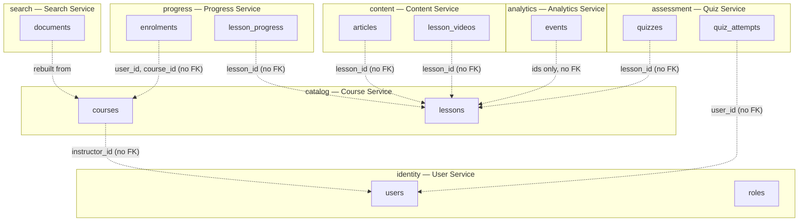
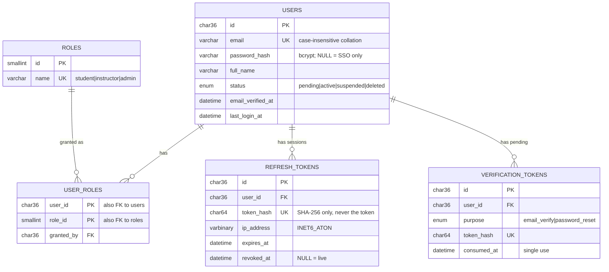
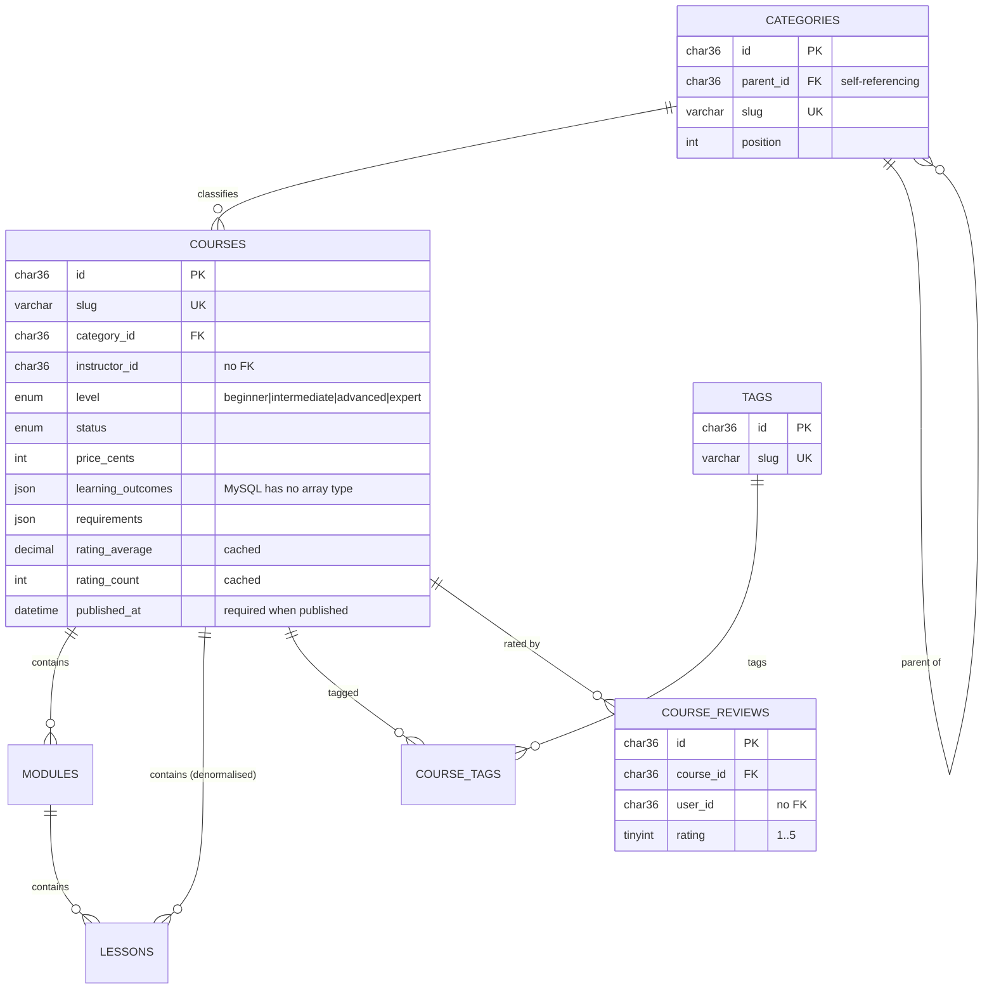
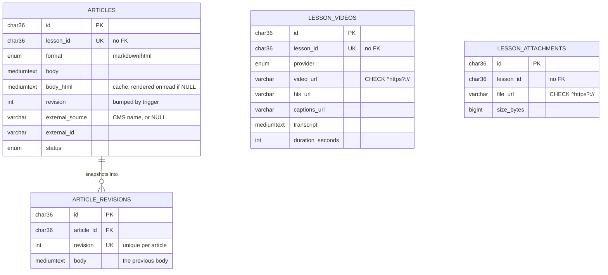
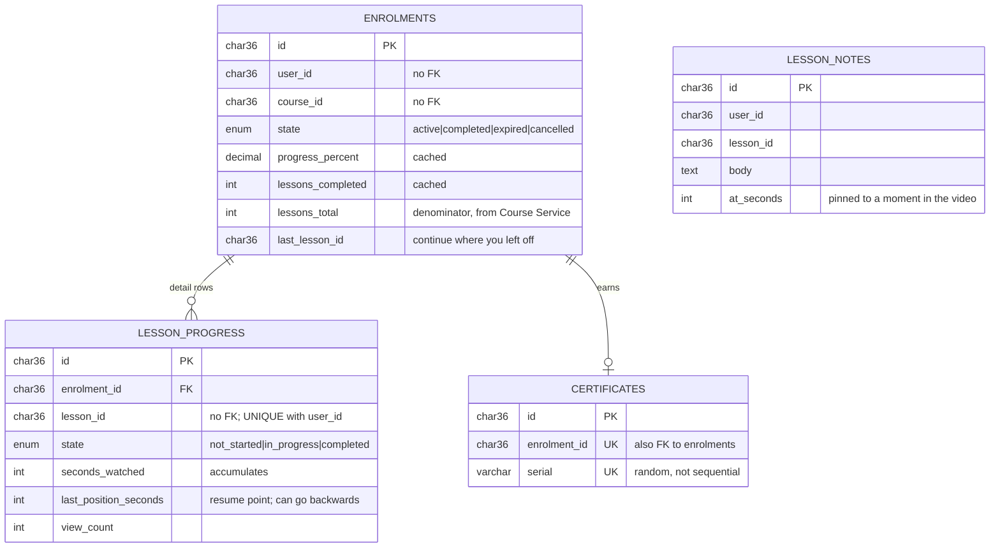
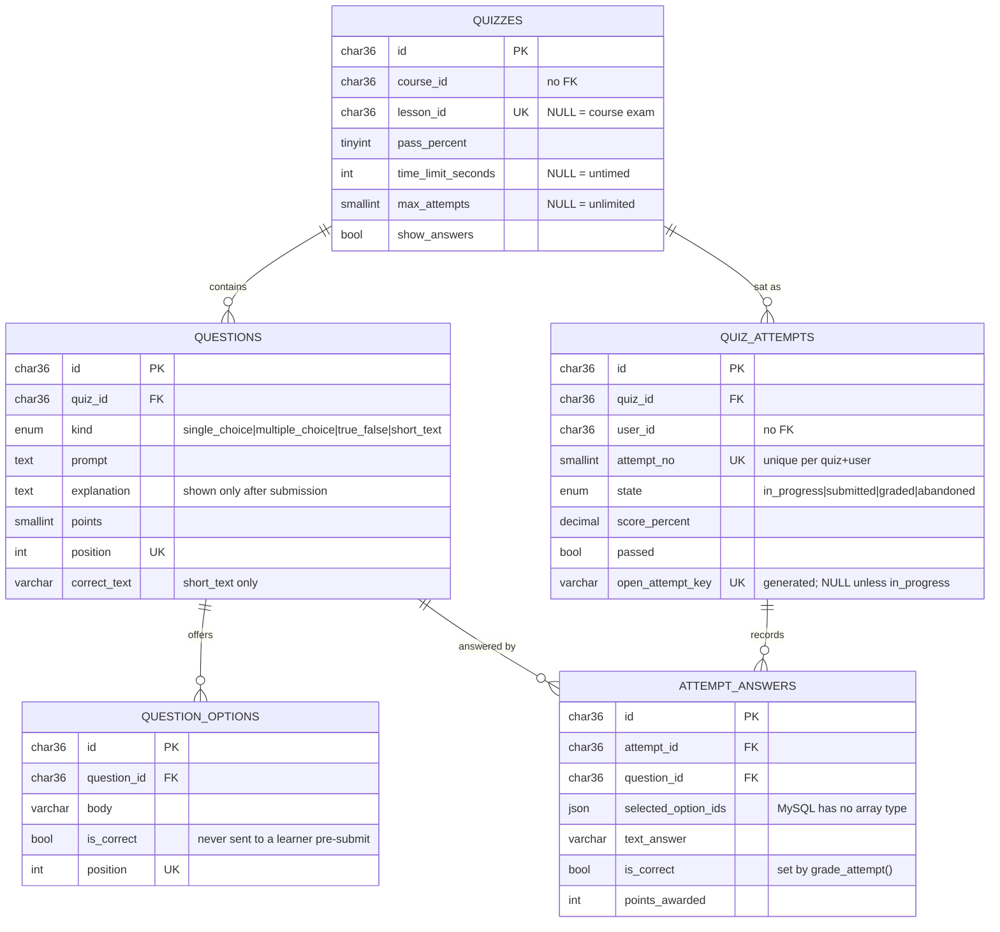
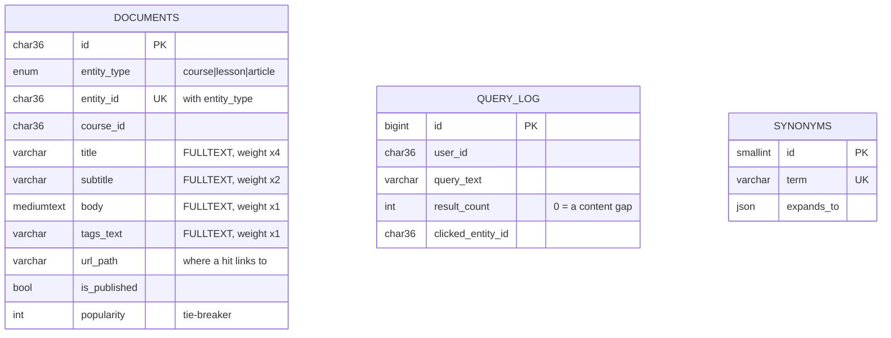
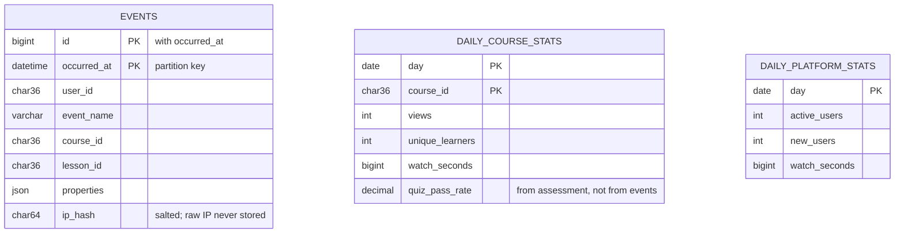
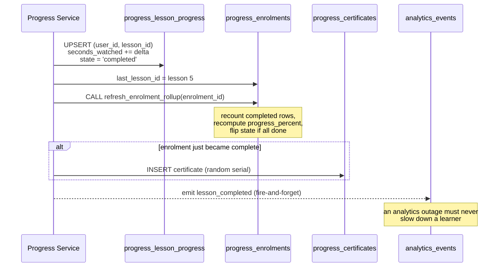

# Entity-relationship diagrams

If you read one thing here, read **The spine**. Everything else in the schema
hangs off it.

> There is also a **[visual version](https://claude.ai/code/artifact/9c966486-1cd3-48e3-b168-d8465097a467)**
> of this page — same content, drawn rather than described. A copy ships in the
> repo as [`docs/erd.html`](erd.html); open it directly in a browser.

- [The spine](#the-spine) — the chain every other table refers to
- [Seven owners, one server](#seven-owners-one-server) — where the foreign keys stop
- [identity](#identity--user-service) · [catalog](#catalog--course-service) ·
  [content](#content--content-service) · [progress](#progress--progress-service) ·
  [assessment](#assessment--quiz-service) · [search](#search--search-service) ·
  [analytics](#analytics--analytics-service)
- [Following one action](#following-one-action)

---

## The spine

A course holds ordered modules; a module holds ordered lessons; a lesson has
**exactly one kind of body**, and which kind is named by `lessons.kind`.

```mermaid
erDiagram
    COURSES  ||--o{ MODULES : "has ordered"
    MODULES  ||--o{ LESSONS : "has ordered"
    LESSONS  ||--o| LESSON_VIDEOS : "kind = video"
    LESSONS  ||--o| ARTICLES      : "kind = article"
    LESSONS  ||--o| QUIZZES       : "kind = quiz"
    LESSONS  ||--o{ LESSON_ATTACHMENTS : "downloads"

    COURSES {
        char36 id PK
        varchar slug UK
        varchar title
        char36 instructor_id "identity_users - no FK"
        enum status "draft|in_review|published|archived"
        int lesson_count "cached"
        int duration_minutes "cached"
    }
    MODULES {
        char36 id PK
        char36 course_id FK
        varchar title
        int position UK "unique per course"
    }
    LESSONS {
        char36 id PK
        char36 module_id FK
        char36 course_id FK "denormalised, trigger-checked"
        varchar slug UK "unique per course"
        enum kind "video|article|quiz|assignment"
        int position UK "unique per module"
        int duration_seconds
        bool is_free_preview
    }
    LESSON_VIDEOS {
        char36 id PK
        char36 lesson_id UK "no FK - different service"
        enum provider "youtube|vimeo|mux|..."
        varchar video_url "the URL, never the file"
        varchar hls_url
        text transcript "indexed by Search"
    }
    ARTICLES {
        char36 id PK
        char36 lesson_id UK "no FK - different service"
        enum format "markdown|html"
        mediumtext body "the source"
        mediumtext body_html "render cache, may be NULL"
        varchar external_source "set when synced from a CMS"
    }
    QUIZZES {
        char36 id PK
        char36 lesson_id UK "NULL = course-level exam"
        tinyint pass_percent
        smallint max_attempts "NULL = unlimited"
    }
    LESSON_ATTACHMENTS {
        char36 id PK
        char36 lesson_id
        varchar file_url "a URL, never the bytes"
    }
```

Three things to notice:

1. **`lessons.course_id` is redundant** — you could reach the course through
   `module_id`. It is carried anyway so "all lessons of a course, in order"
   needs no join, and a trigger refuses any row where the two disagree.
2. **A lesson's body lives in another service.** `lesson_videos`, `articles`
   and `quizzes` all point at `lessons.id` with **no foreign key**, because
   they are owned by different services.
3. **Video rows hold URLs.** There is no binary column anywhere in `content`,
   and `tests/verify.sql` fails the build if one appears.

---

## Seven owners, one server

Everything lives in one database. The per-service split is carried by a prefix
on the table name, and the groupings below are that convention.

**Every dotted line is a reference with no constraint behind it.** All 21 real
foreign keys in this schema live *inside* one database:

| Database | Foreign keys within it |
|---|---|
| `identity` | 4 |
| `catalog` | 7 |
| `content` | 1 |
| `progress` | 2 |
| `assessment` | 5 |
| `search`, `analytics` | 0 — both are derived stores |

InnoDB *would* enforce a cross-database foreign key; MySQL supports them. The
omission is deliberate: a foreign key across a service boundary means those two
services can never be moved onto separate servers. See
[`DECISIONS.md`](DECISIONS.md).

---

## identity — User Service

`email` needs no `citext` equivalent: MySQL's default `utf8mb4_0900_ai_ci`
collation is already case-insensitive, so `Ada@x.test` and `ada@x.test` collide
on the unique index.

---

## catalog — Course Service

The four cached columns — `lesson_count`, `duration_minutes`, `rating_average`,
`rating_count` — each have exactly one procedure that recomputes them
(`catalog_refresh_course_rollup`, `catalog_refresh_course_rating`), and
`tests/verify.sql` fails if they drift from the rows they summarise.

---

## content — Content Service

Editing an article fires a `BEFORE UPDATE` trigger that copies the old body
into `article_revisions` and increments `revision`, so history is append-only
and a rollback is a normal write rather than a restore.

---

## progress — Progress Service

`seconds_watched` and `last_position_seconds` are deliberately different
numbers. The first accumulates across rewatches; the second is where the player
resumes, and moves *backwards* when someone rewinds.

---

## assessment — Quiz Service

`open_attempt_key` is how a **partial unique index** is emulated. PostgreSQL
would write `UNIQUE ... WHERE state = 'in_progress'`; MySQL has no such thing,
so a generated column evaluates to `NULL` for every other state — and a MySQL
unique index permits duplicate `NULL`s. Many graded attempts coexist; a second
open one collides.

It is `VIRTUAL`, not `STORED`, because MySQL refuses a cascading foreign key on
a column that a stored generated column reads, and `quiz_id` needs both.

---

## search — Search Service

`documents` is a flattened copy rebuilt by `search_reindex_all()`. It has no
foreign keys by design — it is a derived store, and a stale row is a reindex
away from being fixed.

The five `FULLTEXT` indexes are not redundant: the combined one answers the
`WHERE`, and the per-field ones let the `SELECT` re-score each field so a title
match outranks a body match. MySQL cannot weight inside an index the way a
PostgreSQL `tsvector` can, so weighting moves to query time.

---

## analytics — Analytics Service

`events` is the only table expected to reach hundreds of millions of rows, and
the only one using `BIGINT AUTO_INCREMENT` rather than a uuid — random uuids
scatter inserts across the B-tree, which is the wrong trade for an append-only
log.

MySQL requires the partitioning column in every unique key, which is why the
primary key is `(id, occurred_at)` rather than `id` alone.

---

## Following one action

*Sam finishes lesson 5 of the microservices course.* One `PUT` through the
gateway, and here is every row that moves:

Two details worth keeping:

- The detail write and the rollup happen in **one transaction**, so no reader
  ever sees an updated lesson row beside a stale summary.
- The analytics emit is **not** awaited. Events can be lost, which is precisely
  why nothing authoritative is ever reconstructed from the event stream — the
  drop-off report reads `progress`, not `analytics_events`.
